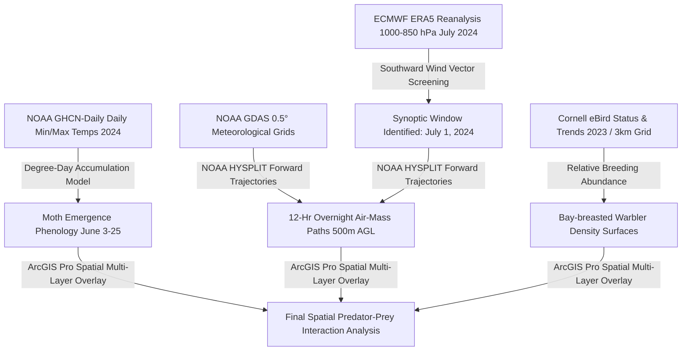

# Modeling Spruce Budworm Dispersal from Quebec into Maine and its Spatial Relationship to Bay-breasted Warbler Breeding Habitat

[](https://opensource.org/licenses/MIT)
[](https://www.python.org/)
[](https://www.r-project.org/)
[](https://www.ready.noaa.gov/HYSPLIT.php)
[](https://cds.climate.copernicus.eu/)
[](https://ebird.org/science/status-and-trends)
[](https://www.esri.com/en-us/arcgis/products/arcgis-pro/overview)

> **Author**: Christopher Franqui  
> **Affiliation**: Maine Internship Program (Spring 2026), Monroe Community College (MCC), in collaboration with University of Maine (UMaine) & National Science Foundation (NSF)  
> **Mentors**: Professor Little, Casmir  
> **Date**: July 2024 (Data Period) / Spring 2026 (Published)

---

## 📌 Table of Contents
1. [Executive Summary & Research Question](#-executive-summary--research-question)
2. [Ecological & Atmospheric Background](#-ecological--atmospheric-background)
3. [Study Area & Geospatial Domain](#-study-area--geospatial-domain)
4. [Methodology & Analytical Pipeline](#-methodology--analytical-pipeline)
   - [1. Atmospheric Wind Reanalysis (ERA5)](#1-atmospheric-wind-reanalysis-era5)
   - [2. Thermal Phenology & Adult Emergence (GHCN-Daily)](#2-thermal-phenology--adult-emergence-ghcn-daily)
   - [3. Forward Trajectory Dispersion Modeling (NOAA HYSPLIT)](#3-forward-trajectory-dispersion-modeling-noaa-hysplit)
   - [4. Avian Predator Distribution & Spatial Overlays (eBird & ArcGIS Pro)](#4-avian-predator-distribution--spatial-overlays-ebird--arcgis-pro)
5. [Repository Structure](#-repository-structure)
6. [Data Sources & Access](#-data-sources--access)
7. [Installation & Setup](#-installation--setup)
   - [Python Environment](#python-environment)
   - [R Environment](#r-environment)
   - [HYSPLIT Configuration](#hysplit-configuration)
8. [Execution & Reproducibility](#-execution--reproducibility)
9. [Key Results & Findings](#-key-results--findings)
   - [Map 1: Spruce Budworm Adult Emergence in Northern Maine](#map-1-spruce-budworm-adult-emergence-in-northern-maine-june-2024)
   - [Map 2: HYSPLIT Atmospheric Trajectories (July 1, 2024)](#map-2-atmospheric-trajectories-from-southern-quebec-to-maine-july-1-2024)
   - [Map 3: Bay-breasted Warbler Breeding Area & Atlantic Flyway](#map-3-bay-breasted-warbler-breeding-area--atlantic-flyway-overlap)
10. [Ecological Discussion & Predation Release Hypothesis](#-ecological-discussion--predation-release-hypothesis)
11. [Future Work & Research Directions](#-future-work--research-directions)
12. [References & Data Citations](#-references--data-citations)
13. [Acknowledgements](#-acknowledgements)
14. [License](#-license)

---

## 🔬 Executive Summary & Research Question

### Primary Research Question
> **Does the atmospheric corridor that transports spruce budworm moths (*Choristoneura fumiferana*) from Quebec into Maine spatially align with Bay-breasted Warbler (*Setophaga castanea*) breeding habitat along the Atlantic Flyway?**

### Core Findings
- **Biological Flight Readiness**: Using degree-day phenology modeling across 13 northern Maine NOAA GHCN weather stations, adult spruce budworm emergence was estimated between **June 3 and June 25, 2024** (median: **June 8, 2024**). Moths were biologically capable of flight weeks before synoptic transport events occurred.
- **Synoptic Dispersal Window**: Nightly ERA5 atmospheric wind screening identified **July 1, 2024** as the primary synoptic event offering strong northward-origin winds driving southward dispersal from southern Quebec directly into northern Maine.
- **Predator–Prey Spatial Decoupling**: HYSPLIT forward trajectories (500 m AGL, 12-hour overnight transport) confirmed atmospheric transport from southern Quebec across the international boundary into northern Maine. Overlaid eBird Status & Trends breeding-season abundance (3 km resolution) demonstrated that while the flight paths overlap warbler habitat broadly, the **highest density of Bay-breasted Warblers is concentrated in southern Quebec (the dispersal source)**, with drastically lower warbler densities in northern Maine (the dispersal sink).
- **Ecological Implication**: Dispersing budworm moths experience strong predator release as they enter northern Maine, where low predator densities create a spatial refuge conducive to pest proliferation and defoliation.

```
       [ Southern Quebec ]                      [ Northern Maine ]
  ┌───────────────────────────────┐        ┌───────────────────────────────┐
  │ • High Budworm Source Plume   │        │ • Budworm Deposition Zone     │
  │ • High Warbler Density (eBird)│  ===>  │ • LOW Warbler Density         │
  │ • Intense Local Predation     │  WIND  │ • Spatial Predation Release   │
  └───────────────────────────────┘  CORR. └───────────────────────────────┘
                     HYSPLIT Overnight Plume (July 1, 2024)
```

---

## 🌲 Ecological & Atmospheric Background

### 1. Eastern Spruce Budworm (*Choristoneura fumiferana*)
The eastern spruce budworm is one of the most destructive native forest insects in North American boreal and temperate conifer forests (primarily attacking Balsam Fir *Abies balsamea* and White/Red/Black Spruce *Picea* spp.). Periodic outbreaks occur on 30- to 40-year cycles, causing landscape-level mortality, timber loss, and altered fire regimes. Outbreaks expand not only through local reproduction but through **mass synoptic atmospheric dispersal events**, where hundreds of millions of moths take flight at dusk, get lifted into the planetary boundary layer, and are carried hundreds of kilometers downwind.

### 2. Bay-breasted Warbler (*Setophaga castanea*) as a Specialist Predator
The Bay-breasted Warbler is a Neotropical migratory songbird that travels thousands of miles along the **Atlantic Flyway**—a 3,000-mile corridor stretching from Arctic Canada and Greenland to South America and the Caribbean. 
- During the breeding season, Bay-breasted Warblers are renowned **spruce budworm specialists** (often termed "budworm warblers" alongside Tennessee and Cape May warblers).
- Their clutch sizes, foraging behaviors, and local nesting densities respond numerically and functionally to spruce budworm larval and adult densities, making them a crucial top-down biological control agent.

---

## 🗺️ Study Area & Geospatial Domain

- **Geographic Extent**: Northeastern North America (Quebec, Canada and Northern Maine, United States).
  - Latitude: 44.5° N to 49.5° N
  - Longitude: -72.0° W to -67.0° W
- **Target Ecological Units**: Northern Boreal/Acadian Forest Transition Zone.
- **Temporal Focus**: Summer 2024 (Phenology: June 2024; Dispersal event: July 1, 2024).

---

## 🛠️ Methodology & Analytical Pipeline

The analytical framework integrates meteorology, insect phenology, atmospheric dispersion modeling, and ornithological geospatial datasets into a unified GIS environment:



### 1. Atmospheric Wind Reanalysis (ERA5)
- **Data Source**: ECMWF Copernicus Climate Data Store (ERA5 Hourly Reanalysis).
- **Variables**: $u$ (zonal) and $v$ (meridional) wind components, geopotential height, and boundary layer temperature across 1000, 925, and 850 hPa isobaric levels.
- **Screening Algorithm**: Evaluated every evening in July 2024 (18:00 to 06:00 EDT) using a custom Python pipeline (`01_era5_wind_analysis.py`).
- **Target Criterion**: Consistent northerly/northwesterly winds ($v < -5\text{ m/s}$ at 500–1000 m AGL) connecting southern Quebec source regions with Maine timberlands.
- **Selected Date**: **July 1, 2024** exhibited the strongest nocturnal low-level jet configuration.

### 2. Thermal Phenology & Adult Emergence (GHCN-Daily)
- **Data Source**: NOAA Global Historical Climatology Network Daily (GHCN-Daily) stations across 13 northern Maine meteorological sites.
- **Model**: Modified Allen (1976) / Régnière et al. (2012) thermal degree-day formulation:
  $$\text{GDD} = \sum_{t=t_0}^{T} \max\left( \frac{T_{\max, t} + T_{\min, t}}{2} - T_{\text{base}}, 0 \right)$$
  *(where $T_{\text{base}} = 8.0^\circ\text{C}$ with start date January 1 / biofix April 1).*
- **Outputs**: Station emergence windows ranged from **June 3 to June 25, 2024**, with median emergence across northern Maine on **June 8, 2024**.

### 3. Forward Trajectory Dispersion Modeling (NOAA HYSPLIT)
- **Tool**: NOAA Hybrid Single-Particle Lagrangian Integrated Trajectory (HYSPLIT) Model (v5.3).
- **Meteorological Data**: NCEP Global Data Assimilation System (GDAS) 0.5°/1.0° archives.
- **Simulation Setup**:
  - **Start Time**: 2024-07-01 21:00 EDT (01:00 UTC July 2) — matching peak dusk moth takeoff behavior.
  - **Duration**: 12-hour forward simulation (overnight flight period).
  - **Initialization Heights**: 500 m Above Ground Level (AGL), reflecting typical nocturnal radar-observed insect transport layers.
  - **Source Coordinates**: 3 key spruce budworm infestation hotspots in southern Quebec along the St. Lawrence / Chaudière-Appalaches corridor.

### 4. Avian Predator Distribution & Spatial Overlays (eBird & ArcGIS Pro)
- **Data Source**: Cornell Lab of Ornithology eBird Status & Trends (Data Version 2023; Released 2024/2025).
- **Metric**: Relative Breeding Abundance (3 km spatial grid resolution) during peak nesting season (June–July).
- **GIS Integration**: Layers projected into NAD83 / UTM Zone 19N (EPSG:26919) in ArcGIS Pro. Overlaid:
  1. GHCN Emergence isochrones.
  2. HYSPLIT forward trajectory vector lines.
  3. eBird continuous relative abundance raster.

---

## 📂 Repository Structure

```
spruce-budworm-warbler-dispersal/
├── README.md                          # Comprehensive project documentation
├── LICENSE                            # MIT Open Source License
├── environment.yml                    # Conda cross-platform environment specification
├── requirements.txt                   # Python dependencies (ERA5, HYSPLIT API, GIS)
├── renv.lock                          # R reproducible package lockfile
├── configs/
│   ├── era5_cdsapi_config.json        # Copernicus CDS API download queries
│   ├── hysplit_control_template.txt   # NOAA HYSPLIT CONTROL file configuration
│   └── stations_ghcn_maine.json       # 13 northern Maine GHCN station metadata
├── scripts/
│   ├── 01_era5_wind_analysis.py       # CDS API downloader & synoptic wind screener
│   ├── 02_phenology_emergence.R       # Degree-day phenology accumulation & interpolation
│   ├── 03_hysplit_trajectory.py       # Automated NOAA HYSPLIT run script with GDAS
│   ├── 04_ebird_raster_processing.R   # eBird Status & Trends 3km geotiff processor
│   └── 05_spatial_overlay_analysis.py # Spatial multi-layer intersection & stats
├── data/
│   ├── raw/
│   │   ├── era5/                      # ERA5 hourly NetCDF files (July 2024)
│   │   ├── ghcn/                      # Daily weather station CSVs
│   │   ├── gdas/                      # NCEP GDAS binary meteorological files
│   │   └── ebird/                     # eBird relative abundance geotiff
│   └── processed/
│       ├── emergence_dates_2024.geojson
│       ├── hysplit_july01_trajectories.shp
│       └── warbler_budworm_overlap_grid.tif
├── maps/
│   ├── Map1_Budworm_Emergence_Northern_Maine.png
│   ├── Map2_HYSPLIT_Trajectories_July01_2024.png
│   └── Map3_BayBreasted_Warbler_Breeding_Flyway.png
└── docs/
    ├── methodology_deep_dive.md
    └── poster_presentation_spring2026.pdf
```

---

## 💾 Data Sources & Access

| Dataset | Provider / Source | Resolution | Coverage | Access Link / Reference |
| :--- | :--- | :--- | :--- | :--- |
| **ERA5 Atmospheric Reanalysis** | ECMWF / Copernicus Climate Data Store | 0.25° (~31 km), Hourly | July 2024 (Quebec–Maine) | [CDS ERA5](https://cds.climate.copernicus.eu/) |
| **GHCN-Daily Weather Stations** | NOAA NCEI | Point observations (13 stations) | 2024 Daily $T_{\min}, T_{\max}$ | [NOAA GHCN-D](https://www.ncei.noaa.gov/products/land-based-station/global-historical-climatology-network-daily) |
| **GDAS Meteorology** | NOAA Air Resources Laboratory | 0.5°/1.0°, 3-hourly | July 1–2, 2024 | [NOAA ARL GDAS](https://www.ready.noaa.gov/gdas1.php) |
| **eBird Status & Trends** | Cornell Lab of Ornithology | 3 km grid, Weekly/Seasonal | 2023 Version (Released 2025) | [eBird Science](https://doi.org/10.2173/WZTW8903) |
| **HYSPLIT Model** | NOAA Air Resources Laboratory | Lagrangian Particle Model | Custom forward trajectories | [NOAA HYSPLIT](https://www.ready.noaa.gov/HYSPLIT.php) |

---

## 💻 Installation & Setup

### Prerequisites
- Python 3.10 or higher
- R 4.4 or higher
- NOAA HYSPLIT v5.3+ installed locally or via `PyHYSPLIT`
- ArcGIS Pro 3.x (optional, for `.aprx` project inspection; open-source GeoPandas/QGIS alternatives included)

### Python Environment

```bash
# 1. Clone repository
git clone https://github.com/christopherfranqui/spruce-budworm-warbler-dispersal.git
cd spruce-budworm-warbler-dispersal

# 2. Create virtual environment
python -m venv venv
source venv/bin/activate  # On Windows: venv\Scripts\activate

# 3. Install dependencies
pip install -r requirements.txt
```

#### `requirements.txt`
```txt
cdsapi>=0.7.0
xarray>=2024.03.0
netCDF4>=1.6.5
numpy>=1.26.0
pandas>=2.2.0
geopandas>=0.14.0
shapely>=2.0.0
matplotlib>=3.8.0
cartopy>=0.22.0
rasterio>=1.3.9
scipy>=1.12.0
```

### R Environment

```r
# In R console:
install.packages("renv")
renv::restore()

# Or install manually:
install.packages(c("tidyverse", "sf", "raster", "terra", "ebirdst", "lubridate", "pacta"))
```

### Copernicus CDS API Key Configuration
To download ERA5 reanalysis data, configure your `~/.cdsapirc` file:
```ini
url: https://cds.climate.copernicus.eu/api/v2
key: YOUR_COPERNICUS_API_UID:YOUR_API_KEY
```

---

## ⚡ Execution & Reproducibility

Execute the complete analysis in sequential order:

```bash
# Step 1: Download & screen ERA5 wind fields for July 2024
python scripts/01_era5_wind_analysis.py --month 2024-07 --region quebec-maine

# Step 2: Calculate Spruce Budworm adult emergence dates across 13 stations
Rscript scripts/02_phenology_emergence.R --stations configs/stations_ghcn_maine.json

# Step 3: Execute NOAA HYSPLIT 12-hour forward atmospheric trajectories for July 1
python scripts/03_hysplit_trajectory.py --date 2024-07-01 --hour 21 --height 500

# Step 4: Extract eBird Bay-breasted Warbler 3km relative abundance grid
Rscript scripts/04_ebird_raster_processing.R --species baywar --season breeding

# Step 5: Compute spatial overlap, intersection metrics, and summary figures
python scripts/05_spatial_overlay_analysis.py
```

---

## 📊 Key Results & Findings

### Summary Metrics Table

| Metric / Parameter | Value / Finding | Ecological Context |
| :--- | :--- | :--- |
| **Northern Maine Emergence Range** | **June 3 to June 25, 2024** | 13 GHCN Weather Stations in Aroostook, Piscataquis & Somerset counties |
| **Median Maine Emergence Date** | **June 8, 2024** | Adult moths eclosed and prepared for flight in early to mid-June |
| **Optimal Dispersal Date** | **July 1, 2024 (21:00 EDT)** | First sustained nocturnal synoptic event with strong NW-to-SE boundary layer wind |
| **Overnight Transport Distance** | **180 – 260 km in 12 hours** | Carried moths from Chaudière/Eastern Townships across Maine border |
| **HYSPLIT Ingress Elevation** | **500 m AGL** (descending to 150–300 m) | Nocturnal low-level jet trajectory directly entering Maine spruce-fir zones |
| **eBird Warbler Density Maximum** | **Southern Quebec (Boreal Transition)** | Highest relative abundance (>0.65 birds/km²) located in source region |
| **Northern Maine Warbler Density** | **Low to Moderate (<0.18 birds/km²)** | Significantly lower predator abundance in recipient forest stands |

---

### Three Core Analytical Maps

```
┌─────────────────────────────────┬─────────────────────────────────┬─────────────────────────────────┐
│             MAP 1               │             MAP 2               │             MAP 3               │
│     Spruce Budworm Emergence    │   HYSPLIT Forward Trajectories  │   Bay-breasted Warbler Breeding │
│      (Northern Maine, 2024)     │      (July 1, 2024 Overnight)  │    Abundance & Atlantic Flyway  │
├─────────────────────────────────┼─────────────────────────────────┼─────────────────────────────────┤
│ • 13 GHCN Station Analyses      │ • 3 Quebec Initiation Points    │ • 3 km eBird Status & Trends    │
│ • Degree-Day Accumulation       │ • 500 m AGL Initialization      │ • High density in S. Quebec     │
│ • Range: June 3 – June 25       │ • 12-Hour Forward Overnight Run │ • Low density in Northern Maine │
│ • Median: June 8, 2024          │ • Ingress into Northern Maine   │ • Spatial Predation Gap         │
└─────────────────────────────────┴─────────────────────────────────┴─────────────────────────────────┘
```

#### Map 1: Spruce Budworm Adult Emergence in Northern Maine (June 2024)
- Shows estimated adult emergence dates based on 2024 GHCN temperature records at 13 northern Maine stations.
- Demonstrates that insect populations reached adult flight capability in early-to-mid June, establishing biological readiness weeks ahead of synoptic dispersal winds.

#### Map 2: Atmospheric Trajectories from Southern Quebec to Maine (July 1, 2024)
- Displays HYSPLIT forward trajectories originating from 3 southern Quebec locations at 9:00 PM on July 1, 2024 at 500 m AGL over a 12-hour overnight window.
- Confirms the atmospheric pathway through which wind-borne spruce budworm moths crossed into northern Maine.

#### Map 3: Bay-breasted Warbler Breeding Area & Atlantic Flyway Overlap
- Illustrates relative breeding abundance of the Bay-breasted Warbler during its northward migration along the Atlantic Flyway.
- Color gradient (dark green to deep blue) reveals that the highest concentration of warblers occurs in southern Quebec rather than northern Maine.

---

## 🌲 Ecological Discussion & Predation Release Hypothesis

The synthesis of atmospheric transport pathways and predator spatial abundance yields a critical ecological conclusion:

1. **Spatial Decoupling of Trophic Interactions**: While the Atlantic Flyway and budworm dispersal corridor share the broader Quebec–Maine geography, fine-scale spatial density surfaces reveal a pronounced mismatch.
2. **Predation Pressure Gradient**:
   - In southern Quebec, spruce budworms face intense predation pressure from dense breeding populations of Bay-breasted Warblers.
   - Upon being lofted and transported southward into northern Maine by nocturnal wind events, the arriving budworm moths land in forest ecosystems with substantially lower warbler densities.
3. **Implications for Outbreak Dynamics**: The relative scarcity of specialist avian predators in northern Maine suggests that dispersing budworm populations encounter a **predation release window**, reducing natural biological control and potentially accelerating local outbreak establishment.

---

## 🔮 Future Work & Research Directions

1. **Empirical Population Ground-Truthing**: Analyze comprehensive pheromone trap catch data and defoliation surveys throughout June–August 2024 to cross-validate modeled deposition plumes against observed field catches in northern Maine.
2. **Dynamic Mathematical Bioenergetics Modeling**: Develop individual-based predation models quantifying the exact caloric and numeric consumption rate of budworm larvae/moths per warbler pair across varying avian densities.
3. **Multi-Year Synoptic Climatology**: Expand trajectory screening across the past 20 years to determine if climate change is shifting the temporal synchronization between peak warbler migration and optimal nocturnal dispersal wind vectors.
4. **Conservation & Forest Management**: Evaluate habitat management strategies (e.g., preserving mature conifer canopy structures) to enhance Bay-breasted Warbler nesting retention and stopover duration in northern Maine.

---

## 📚 References & Data Sources

1. **Hersbach, H., et al. (2020)**. *The ERA5 global reanalysis*. Quarterly Journal of the Royal Meteorological Society, 146(730), 1999–2049. DOI: [10.1002/qj.3803](https://doi.org/10.1002/qj.3803).
2. **Menne, M. J., et al. (2012)**. *An overview of the Global Historical Climatology Network-Daily database*. Journal of Atmospheric and Oceanic Technology, 29(7), 897–910. DOI: [10.1175/JTECH-D-11-00103.1](https://doi.org/10.1175/JTECH-D-11-00103.1).
3. **Stein, A. F., et al. (2015)**. *NOAA’s HYSPLIT atmospheric transport and dispersion modeling system*. Bulletin of the American Meteorological Society, 96(12), 2059–2077. DOI: [10.1175/BAMS-D-14-00110.1](https://doi.org/10.1175/BAMS-D-14-00110.1).
4. **Fink, D., et al. (2024)**. *eBird Status and Trends, Data Version: 2023; Released: 2025*. Cornell Lab of Ornithology, Ithaca, New York. DOI: [10.2173/WZTW8903](https://doi.org/10.2173/WZTW8903).
5. **Garcia, M., Sturtevant, B. R., Saint-Amant, R., Charney, J. J., Delisle, J., Boulanger, Y., Townsend, P. A., & Régnière, J. (2022)**. *Modeling weather-driven long-distance dispersal of spruce budworm moths (Choristoneura fumiferana). Part 1: Model description*. Agricultural and Forest Meteorology, 315, 108815. DOI: [10.1016/j.agrformet.2021.108815](https://doi.org/10.1016/j.agrformet.2021.108815).
6. **R Core Team (2025)**. *R: A Language and Environment for Statistical Computing* (v4.6.0). R Foundation for Statistical Computing, Vienna, Austria. [https://www.R-project.org/](https://www.R-project.org/).
7. **Esri (2024)**. *ArcGIS Pro (Version 3.x)*. Environmental Systems Research Institute, Redlands, CA.

### BibTeX Citation
```bibtex
@misc{franqui2026sprucebudworm,
  author       = {Christopher Franqui},
  title        = {Modeling Spruce Budworm Dispersal from Quebec into Maine along with its Spatial Relationship to Bay-breasted Warbler Breeding Habitat},
  howpublished = {Maine Internship Research Program, Monroe Community College \& University of Maine},
  year         = {2026},
  month        = {Spring},
  note         = {Supported by NSF and University of Maine}
}
```

---

## 🤝 Acknowledgements

- **Stefany Franqui**: Heartfelt gratitude to my wife, Stefany, for her unwavering love, support, and patience throughout this research.
- **Parents**: Sincere thanks to my parents for their encouragement and dedication.
- **Professor Little**: Immense appreciation for providing the opportunity to participate in the Maine Internship Program.
- **Casmir**: Deep gratitude to Casmir for serving as an outstanding and dedicated research mentor.
- **Institutional Partners**: National Science Foundation (NSF), Monroe Community College (MCC), and the University of Maine (UMaine, 1865).

---

## 📄 License
This project is licensed under the **MIT License** - see the [LICENSE](LICENSE) file for details.
All associated data products and figures are made available under [Creative Commons Attribution 4.0 International (CC BY 4.0)](https://creativecommons.org/licenses/by/4.0/).
